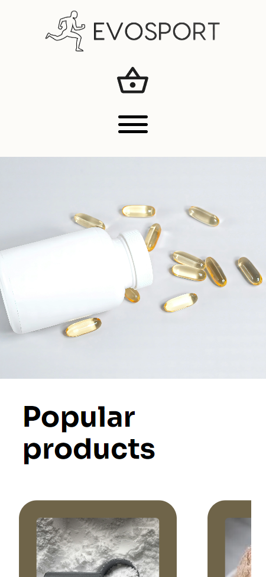

<center></center>


# EvoSport Nutrition

EvoSport Nutrition is a full-stack E-Commerce store specializing in sports goods and supplements, featuring an intuitive interface to enhance the shopping experience.


## Screenshots





## API Reference

#### All products

```http
GET /api/products
```
#### AD image names
```http
GET /api/ad-images
```

## Tech Stack

- **Client:** JavaScript & SASS
- **Server:** PHP (With composer), MySQL & Apache
## Run Locally

#### Requirements
You'll need: [PHP](https://www.php.net/downloads.php), [Composer](https://getcomposer.org/), [MySQL](https://dev.mysql.com/downloads/installer/) & [Node.js](https://nodejs.org/en) (for npm) all installed.

Clone the project

```bash
  git clone https://github.com/wisyxx/EvoSport-Nutrition.git
```

Go to the project directory

```bash
  cd EvoSport-Nutrition
```

Install dev dependencies

```bash
  npm install -D
```

Run gulp tasks

```bash
  npm start
```

Start the server

```bash
  cd public
  php -S localhost:3000
```
[](https://choosealicense.com/licenses/mit/)
